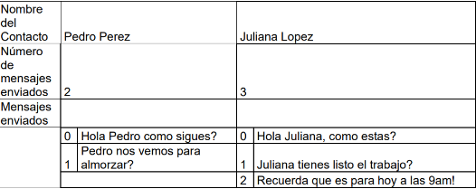

## MENSAJES 

X necesita llevar el rastro de los mensajes que envía, para eso se le ocurrió que necesita un 
aplicativo para almacenar en memoria (no en archivos) la siguiente información que le permite 
controlar los mensajes que envía. Nombre del Contacto, Número de mensajes enviados, mensajes 
enviados.
En memoria la información sería:

a) Elaborar una función que reciba el nombre del contacto, si el contacto existe, solicitar el 
mensaje, incrementar el número de mensajes enviados del contacto y adicionarlo al arreglo 
dinámico de mensajes. Si el contacto no existe, se debe adicionar el contacto y el mensaje.
b) Elaborar una función que muestre la lista de contactos y los mensajes enviados hasta el 
momento por cada contacto.
Nota: El arreglo de contactos y el arreglo de mensajes enviados, debe ser declarado de forma 
dinámica y ser recorridos usando el concepto de apuntadores, no se puede utilizar subíndices.